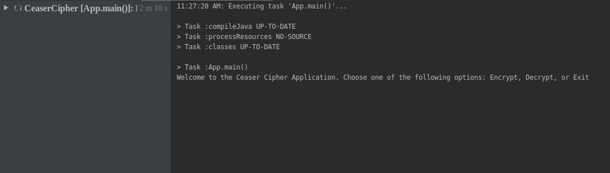

# Ceaser Cipher
#### A Caesar cipher is a type of substitution in which each letter is shifted a certain number of places, 7th September 2019
#### By **Cates NSENGIYUMVA**
## Description
A Caesar cipher is a type of substitution in which each letter is shifted a certain number of places also known as a key, down the alphabet.  For example, with a shift of 1, A would be replaced by B, B would become C, and so on.
## Setup/Installation Requirements
* Go to GitHub account => www.github.com/ktscates
* Go to my repositories
* Select Ceaser-Cipher.
* Click on the green button labeled: clone or download. you can clone or download it directly into your computer.
* Unzip the folder.
* You should have all the project files.
## BDD
* The user have to choose which option he need "Encrypt", "Decrypt" or "Exit".
* If the user chooses the "Encrypt" option, he/she will be required to enter a word of his/her choice that he/she want to encrypt.
* after choosing the word, the user will be required to enter a shift key to use for his/her encryption.
* Then the application will output the encrypted word.
* The same process is done if the user chooses the "Decrypt" option except that this time the application will decrypt the encrypted word.
* Then the application will output the decrypted word.
* If the user chooses the "Exit" option, the application will exit. 
## Screenshots
# Welcome

## Known Bugs
There no bugs in the application.
## Technologies Used
* Java
## Support and contact details
If you run into errors, please feel free to contact me on github.
### License
Copyright (c) 2019 **Cates NSENGIYUMVA**
